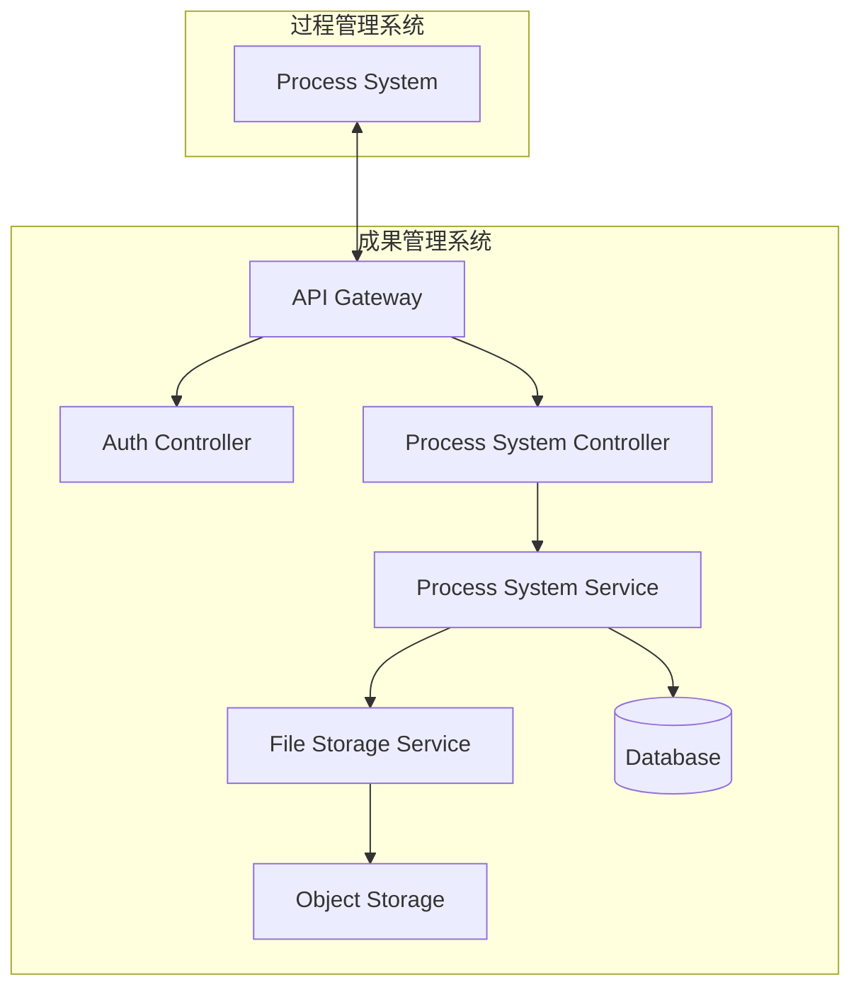

# Design Document

## Overview

本设计文档描述了成果管理系统与过程管理系统集成功能的技术架构和实现方案。该集成通过RESTful API实现双向数据交互，支持项目提交物的存储、检索和文件管理功能。

## Architecture

### 系统架构图



### 技术栈

- **后端框架**: Spring Boot 2.x
- **数据库**: MySQL 8.0
- **文件存储**: 本地存储/阿里云OSS
- **API文档**: OpenAPI 3.0 (Swagger)
- **认证方式**: API Key + 签名验证
- **数据格式**: JSON

## Components and Interfaces

### 1. API Gateway Layer

**职责**: 请求路由、认证验证、限流控制、日志记录

**核心功能**:
- API密钥验证
- 请求签名校验
- 频率限制控制
- 请求/响应日志记录

### 2. Process System Controller

**职责**: 处理过程管理系统的API请求

**主要接口**:

#### 2.1 存储项目提交物
```http
POST /api/v1/process-system/submissions
Content-Type: application/json
Authorization: Bearer {api_key}
X-Signature: {request_signature}

{
  "submission_id": "12345",
  "application_id": "67890",
  "submission_type": "proposal",
  "submission_stage": "application",
  "submission_round": 1,
  "submission_version": 1,
  "project_info": {
    "project_name": "智能交通管理系统",
    "project_field": "人工智能",
    "category_level": "重点",
    "category_specific": "智能交通",
    "research_period": 24,
    "project_keywords": "人工智能,交通管理,智能系统",
    "project_description": "基于AI的智能交通管理系统...",
    "expected_results": "预期开发出...",
    "willing_adjust": "Y"
  },
  "applicant_info": {
    "applicant_name": "张三",
    "id_card": "110101199001011234",
    "education_degree": "博士",
    "technical_title": "高级工程师",
    "email": "zhangsan@example.com",
    "phone": "13800138000",
    "work_unit": "某某大学",
    "unit_address": "北京市海淀区...",
    "representative_achievements": "主要成果包括..."
  },
  "files": {
    "proposal_file": {
      "file_id": "file_001",
      "file_name": "申报书.pdf",
      "file_size": 2048576,
      "file_type": "pdf",
      "file_content": "base64_encoded_content"
    },
    "other_attachments": [
      {
        "file_id": "file_002",
        "file_name": "附件1.docx",
        "file_size": 1024000,
        "file_type": "docx",
        "file_content": "base64_encoded_content"
      }
    ]
  },
  "upload_info": {
    "uploader_id": "user_123",
    "uploader_name": "李四",
    "submission_description": "首次提交申报书"
  }
}
```

**响应**:
```json
{
  "code": 200,
  "message": "存储成功",
  "data": {
    "submission_id": "12345",
    "storage_id": "internal_id_456",
    "files": [
      {
        "file_id": "file_001",
        "storage_url": "/files/submissions/12345/proposal.pdf"
      },
      {
        "file_id": "file_002",
        "storage_url": "/files/submissions/12345/attachment1.docx"
      }
    ],
    "created_at": "2026-01-23T10:30:00Z"
  }
}
```

#### 2.2 检索项目提交物
```http
GET /api/v1/process-system/submissions?application_id=67890&submission_stage=application
Authorization: Bearer {api_key}
X-Signature: {request_signature}
```

**响应**:
```json
{
  "code": 200,
  "message": "查询成功",
  "data": {
    "total": 2,
    "submissions": [
      {
        "submission_id": "12345",
        "application_id": "67890",
        "submission_type": "proposal",
        "submission_stage": "application",
        "submission_round": 1,
        "submission_version": 1,
        "project_name": "智能交通管理系统",
        "applicant_name": "张三",
        "upload_time": "2026-01-23T10:30:00Z",
        "files_count": 2,
        "files": [
          {
            "file_id": "file_001",
            "file_name": "申报书.pdf",
            "file_size": 2048576,
            "file_type": "pdf",
            "storage_url": "/files/submissions/12345/proposal.pdf"
          }
        ]
      }
    ]
  }
}
```

#### 2.3 获取提交物详情
```http
GET /api/v1/process-system/submissions/{submission_id}
Authorization: Bearer {api_key}
X-Signature: {request_signature}
```

**响应**:
```json
{
  "code": 200,
  "message": "查询成功",
  "data": {
    "submission_id": "12345",
    "application_id": "67890",
    "submission_type": "proposal",
    "submission_stage": "application",
    "submission_round": 1,
    "submission_version": 1,
    "project_info": {
      "project_name": "智能交通管理系统",
      "project_field": "人工智能",
      "category_level": "重点",
      "category_specific": "智能交通",
      "research_period": 24,
      "project_keywords": "人工智能,交通管理,智能系统",
      "project_description": "基于AI的智能交通管理系统...",
      "expected_results": "预期开发出...",
      "willing_adjust": "Y"
    },
    "applicant_info": {
      "applicant_name": "张三",
      "id_card": "110101199001011234",
      "education_degree": "博士",
      "technical_title": "高级工程师",
      "email": "zhangsan@example.com",
      "phone": "13800138000",
      "work_unit": "某某大学",
      "unit_address": "北京市海淀区...",
      "representative_achievements": "主要成果包括..."
    },
    "files": [
      {
        "file_id": "file_001",
        "file_name": "申报书.pdf",
        "file_size": 2048576,
        "file_type": "pdf",
        "file_category": "proposal",
        "storage_url": "/files/submissions/12345/proposal.pdf"
      },
      {
        "file_id": "file_002",
        "file_name": "附件1.docx",
        "file_size": 1024000,
        "file_type": "docx",
        "file_category": "attachment",
        "storage_url": "/files/submissions/12345/attachment1.docx"
      }
    ],
    "upload_info": {
      "uploader_id": "user_123",
      "uploader_name": "李四",
      "upload_time": "2026-01-23T10:30:00Z",
      "submission_description": "首次提交申报书"
    },
    "sync_time": "2026-01-23T10:30:00Z"
  }
}
```

### 3. Process System Service

**职责**: 业务逻辑处理、数据转换、文件管理

**核心方法**:
- `storeSubmission(SubmissionRequest request)`: 存储提交物
- `getSubmissions(QueryParams params)`: 查询提交物列表
- `getSubmissionDetail(String submissionId)`: 获取提交物详情
- `getFileDownloadUrl(String fileId)`: 获取文件下载链接
- `batchDownloadFiles(List<String> fileIds)`: 批量下载文件

### 4. File Storage Service

**职责**: 文件存储、访问控制、临时链接生成

**核心功能**:
- 文件上传和存储
- 文件访问权限控制
- 临时下载链接生成
- 文件元数据管理

## Data Models

### 1. 项目提交物主表 (process_submissions)

```sql
CREATE TABLE process_submissions (
    id BIGINT PRIMARY KEY AUTO_INCREMENT COMMENT '主键ID',
    submission_id VARCHAR(64) NOT NULL COMMENT '提交物ID（来自过程系统）',
    application_id VARCHAR(64) NOT NULL COMMENT '申报ID（来自过程系统）',
    submission_type VARCHAR(30) NOT NULL COMMENT '提交物类型',
    submission_stage VARCHAR(30) NOT NULL COMMENT '提交阶段',
    submission_round INT NOT NULL DEFAULT 1 COMMENT '提交轮次',
    submission_version INT NOT NULL DEFAULT 1 COMMENT '版本号',
    
    -- 项目基本信息
    project_name VARCHAR(200) NOT NULL COMMENT '项目名称',
    project_field VARCHAR(100) COMMENT '项目领域',
    category_level VARCHAR(20) NOT NULL COMMENT '类别级别',
    category_specific VARCHAR(100) NOT NULL COMMENT '具体分类',
    research_period INT COMMENT '研究周期(月)',
    project_keywords VARCHAR(500) COMMENT '项目关键词',
    project_description TEXT NOT NULL COMMENT '项目描述',
    expected_results TEXT COMMENT '预期成果',
    willing_adjust CHAR(1) COMMENT '是否愿意调整',
    
    -- 申报人信息
    applicant_name VARCHAR(100) NOT NULL COMMENT '申报人姓名',
    id_card VARCHAR(30) COMMENT '证件号码',
    education_degree VARCHAR(50) COMMENT '学历学位',
    technical_title VARCHAR(50) COMMENT '技术职称',
    email VARCHAR(100) COMMENT '邮箱',
    phone VARCHAR(20) NOT NULL COMMENT '联系电话',
    work_unit VARCHAR(200) COMMENT '工作单位',
    unit_address VARCHAR(300) COMMENT '单位地址',
    representative_achievements TEXT COMMENT '代表成果',
    
    -- 上传信息
    uploader_id VARCHAR(64) NOT NULL COMMENT '上传者ID',
    uploader_name VARCHAR(100) NOT NULL COMMENT '上传者姓名',
    upload_time DATETIME NOT NULL COMMENT '上传时间',
    submission_description TEXT COMMENT '提交说明',
    
    -- 系统字段
    sync_time DATETIME NOT NULL DEFAULT CURRENT_TIMESTAMP COMMENT '同步时间',
    created_at DATETIME NOT NULL DEFAULT CURRENT_TIMESTAMP,
    updated_at DATETIME NOT NULL DEFAULT CURRENT_TIMESTAMP ON UPDATE CURRENT_TIMESTAMP,
    is_deleted TINYINT NOT NULL DEFAULT 0 COMMENT '删除标记',
    
    UNIQUE KEY uk_submission_id (submission_id),
    KEY idx_application_id (application_id),
    KEY idx_project_name (project_name),
    KEY idx_applicant_name (applicant_name),
    KEY idx_upload_time (upload_time)
) COMMENT='过程系统项目提交物表';
```

### 2. 提交物文件表 (process_submission_files)

```sql
CREATE TABLE process_submission_files (
    id BIGINT PRIMARY KEY AUTO_INCREMENT COMMENT '主键ID',
    submission_id VARCHAR(64) NOT NULL COMMENT '提交物ID',
    file_id VARCHAR(200) NOT NULL COMMENT '文件ID（来自过程系统）',
    file_name VARCHAR(200) NOT NULL COMMENT '文件名称',
    file_size BIGINT COMMENT '文件大小(字节)',
    file_type VARCHAR(50) COMMENT '文件类型',
    file_category VARCHAR(20) NOT NULL COMMENT '文件分类：proposal/attachment',
    
    -- 存储信息
    storage_path VARCHAR(500) NOT NULL COMMENT '存储路径',
    storage_url VARCHAR(500) COMMENT '访问URL',
    file_hash VARCHAR(64) COMMENT '文件哈希值',
    
    -- 系统字段
    created_at DATETIME NOT NULL DEFAULT CURRENT_TIMESTAMP,
    updated_at DATETIME NOT NULL DEFAULT CURRENT_TIMESTAMP ON UPDATE CURRENT_TIMESTAMP,
    is_deleted TINYINT NOT NULL DEFAULT 0 COMMENT '删除标记',
    
    UNIQUE KEY uk_file_id (file_id),
    KEY idx_submission_id (submission_id),
    KEY idx_file_category (file_category),
    FOREIGN KEY fk_submission (submission_id) REFERENCES process_submissions(submission_id)
) COMMENT='过程系统提交物文件表';
```

### 3. API访问日志表 (process_api_logs)

```sql
CREATE TABLE process_api_logs (
    id BIGINT PRIMARY KEY AUTO_INCREMENT COMMENT '主键ID',
    request_id VARCHAR(64) NOT NULL COMMENT '请求ID',
    api_key VARCHAR(64) NOT NULL COMMENT 'API密钥',
    method VARCHAR(10) NOT NULL COMMENT 'HTTP方法',
    url VARCHAR(500) NOT NULL COMMENT '请求URL',
    request_body TEXT COMMENT '请求体',
    response_code INT NOT NULL COMMENT '响应状态码',
    response_body TEXT COMMENT '响应体',
    response_time INT NOT NULL COMMENT '响应时间(ms)',
    client_ip VARCHAR(45) NOT NULL COMMENT '客户端IP',
    user_agent VARCHAR(500) COMMENT 'User Agent',
    created_at DATETIME NOT NULL DEFAULT CURRENT_TIMESTAMP,
    
    KEY idx_api_key (api_key),
    KEY idx_created_at (created_at),
    KEY idx_response_code (response_code)
) COMMENT='过程系统API访问日志表';
```

## Error Handling

### 错误码定义

| 错误码 | HTTP状态码 | 描述 | 处理方式 |
|--------|------------|------|----------|
| 10001 | 400 | 请求参数无效 | 检查请求格式和必填字段 |
| 10002 | 401 | API密钥无效 | 检查API密钥是否正确 |
| 10003 | 401 | 签名验证失败 | 检查签名算法和密钥 |
| 10004 | 403 | 访问频率超限 | 降低请求频率 |
| 10005 | 404 | 资源不存在 | 检查资源ID是否正确 |
| 10006 | 413 | 文件大小超限 | 压缩文件或分片上传 |
| 10007 | 415 | 文件类型不支持 | 使用支持的文件格式 |
| 10008 | 500 | 存储服务异常 | 重试或联系管理员 |
| 10009 | 500 | 数据库异常 | 重试或联系管理员 |

### 错误响应格式

```json
{
  "code": 10001,
  "message": "请求参数无效",
  "details": {
    "field": "project_name",
    "error": "项目名称不能为空"
  },
  "request_id": "req_123456789",
  "timestamp": "2026-01-23T10:30:00Z"
}
```

## Testing Strategy

### 单元测试

**测试范围**:
- Controller层API接口测试
- Service层业务逻辑测试
- 数据访问层测试
- 文件存储服务测试

**测试工具**: JUnit 5 + Mockito + Spring Boot Test

**测试覆盖率目标**: 80%以上

### 集成测试

**测试场景**:
- 完整的API请求-响应流程
- 数据库事务一致性
- 文件上传下载流程
- 错误处理机制

### 性能测试

**测试指标**:
- API响应时间 < 2秒
- 文件上传速度 > 1MB/s
- 并发请求支持 > 100 QPS
- 数据库连接池效率

### 安全测试

**测试内容**:
- API密钥验证机制
- 请求签名校验
- SQL注入防护
- 文件上传安全检查

## Correctness Properties

*A property is a characteristic or behavior that should hold true across all valid executions of a system-essentially, a formal statement about what the system should do. Properties serve as the bridge between human-readable specifications and machine-verifiable correctness guarantees.*

### Property 1: API请求验证一致性
*For any* API请求（存储、检索、文件操作），API网关应该始终验证请求格式、权限和签名，并在验证失败时返回相应的错误信息
**Validates: Requirements 1.1, 2.1, 4.1, 4.2**

### Property 2: 数据存储完整性
*For any* 有效的项目提交物数据，存储服务应该完整保存所有必填字段，包括项目基本信息、申报人信息、文件信息和提交信息
**Validates: Requirements 1.2, 9.1, 9.2, 9.3, 9.4**

### Property 3: 文件存储一致性
*For any* 成功存储的文件，系统应该生成唯一的文件标识符和存储路径，并正确保存文件元数据
**Validates: Requirements 1.3, 5.3**

### Property 4: 存储操作响应完整性
*For any* 成功的存储操作，API网关应该返回包含提交物ID、存储确认信息和文件存储路径的完整响应
**Validates: Requirements 1.4**

### Property 5: 数据检索准确性
*For any* 检索请求，存储服务应该根据查询条件（申报ID、提交物ID、时间范围）返回准确匹配的记录和完整的文件信息
**Validates: Requirements 2.2, 2.3, 2.4, 2.5**

### Property 6: 同步状态一致性
*For any* 项目提交物的存储或更新操作，同步服务应该记录准确的时间戳，并在查询时返回最新的同步状态信息
**Validates: Requirements 3.1, 3.2**

### Property 7: 批量操作去重性
*For any* 批量同步操作，同步服务应该正确处理增量更新，避免创建重复的数据记录
**Validates: Requirements 3.4**

### Property 8: 错误处理一致性
*For any* 无效请求（格式错误、权限不足、文件超限、类型不支持），系统应该返回相应的错误码和详细的错误信息
**Validates: Requirements 1.5, 4.2, 4.3, 5.1, 5.2, 6.2, 6.4, 10.5**

### Property 9: 频率限制有效性
*For any* 超出频率限制的API请求序列，API网关应该在达到限制后返回429错误并记录相应日志
**Validates: Requirements 4.3**

### Property 10: 权限配置实时生效
*For any* 权限配置的更新操作，API网关应该立即应用新的权限规则，后续请求应该按照新规则进行验证
**Validates: Requirements 4.5**

### Property 11: 数据验证和标准化
*For any* 通过验证的项目提交物数据，存储服务应该按照标准格式进行数据标准化并正确存储，对于未知类型应该使用默认值
**Validates: Requirements 6.1, 6.3, 6.5**

### Property 12: 操作日志完整性
*For any* API请求和存储操作，系统应该记录完整的日志信息，包括请求详情、响应时间、操作类型和结果状态
**Validates: Requirements 7.1, 7.2, 7.3**

### Property 13: 日志查询功能性
*For any* 管理员的日志查询请求，系统应该提供准确的搜索和过滤功能，返回符合条件的日志记录
**Validates: Requirements 7.5**

### Property 14: 管理界面数据展示准确性
*For any* 管理员的页面访问和筛选操作，系统应该显示准确的提交物列表、详情信息和文件列表
**Validates: Requirements 8.1, 8.2, 8.3**

### Property 15: 手动同步功能性
*For any* 管理员执行的手动同步操作，系统应该成功从过程管理系统拉取最新数据并更新本地记录
**Validates: Requirements 8.4**

### Property 16: 导出功能完整性
*For any* 管理员的导出请求，系统应该生成包含完整提交物信息的Excel格式文件
**Validates: Requirements 8.5**

### Property 17: 历史版本查询准确性
*For any* 按版本号和轮次的查询请求，存储服务应该返回准确的历史版本记录
**Validates: Requirements 9.5**

### Property 17: 文件信息查询准确性
*For any* 文件信息查询请求，API网关应该返回准确的文件元数据信息
**Validates: Requirements 10.1, 10.3**